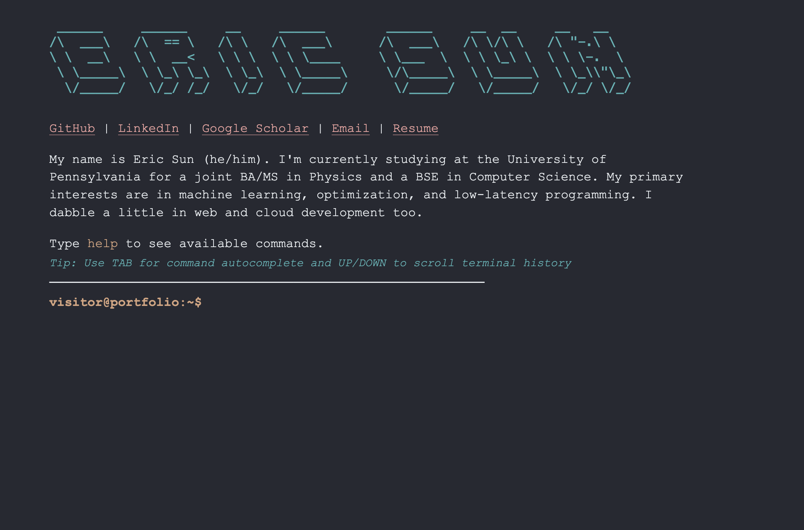

# About

A simple and lightweight terminal-style portfolio written in Astro, CSS, and Typescript. Supports the visitor typing commands to pull information from the profile.



# Installation

```sh
npm install
```

# Development

```sh
npm run dev
```

Visit `localhost:4321` to view the site locally.
